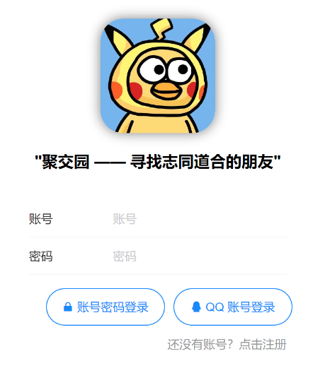
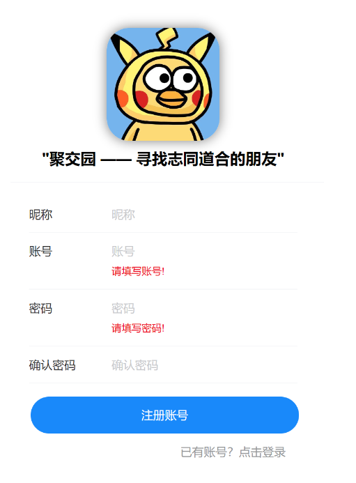
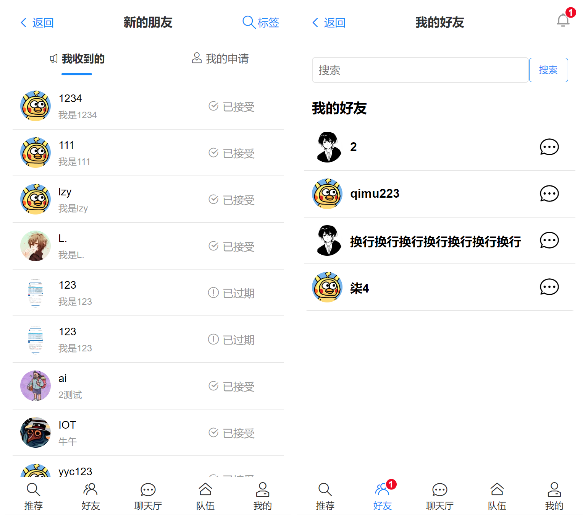
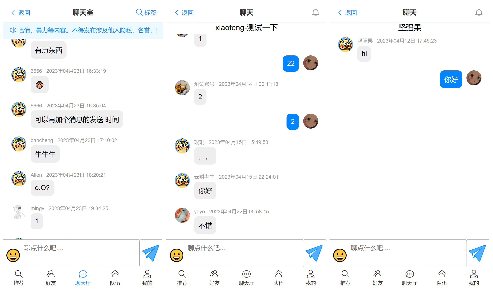
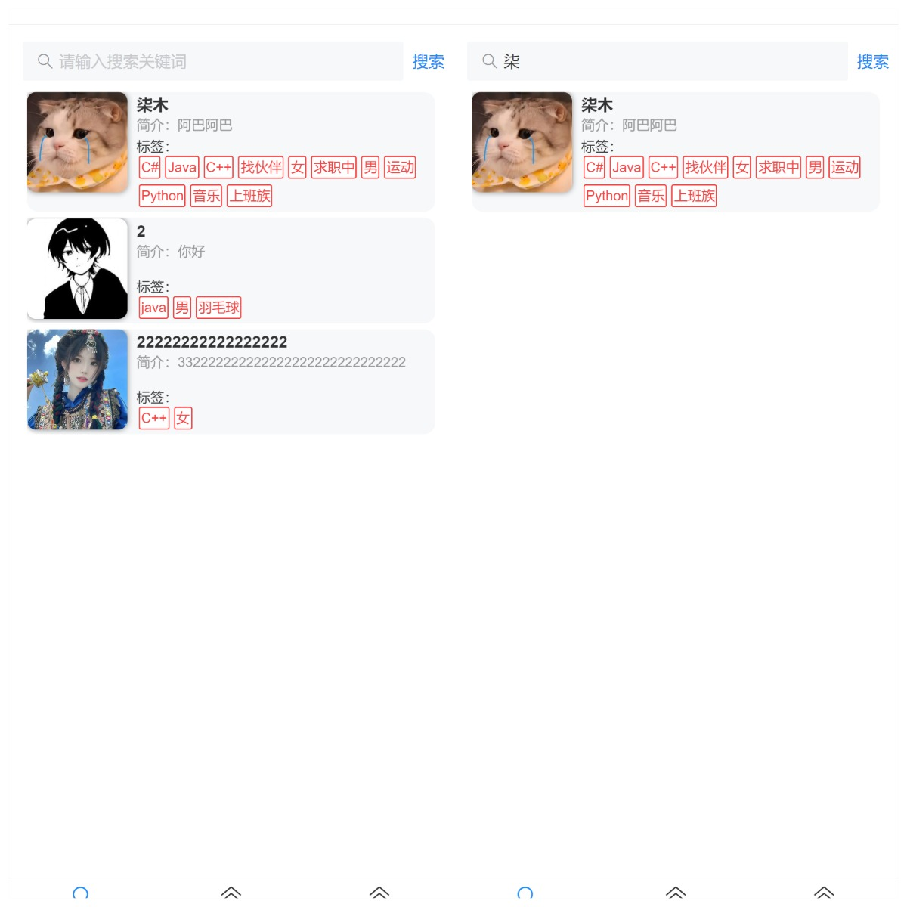
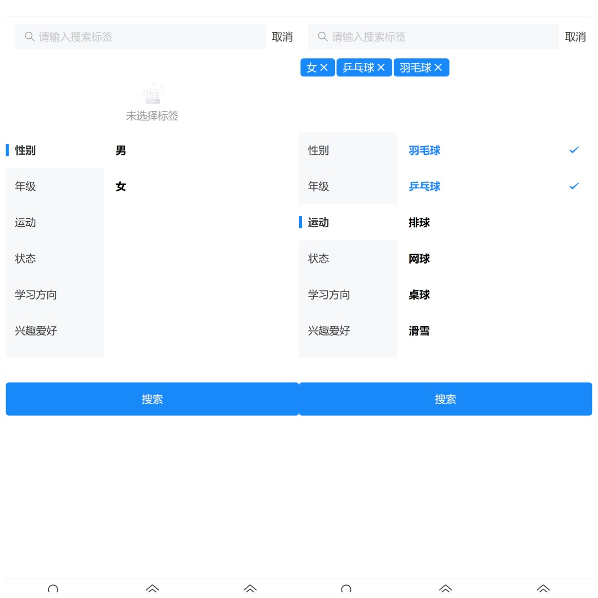
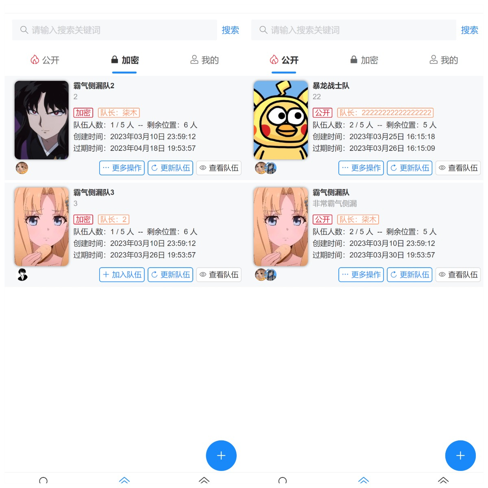
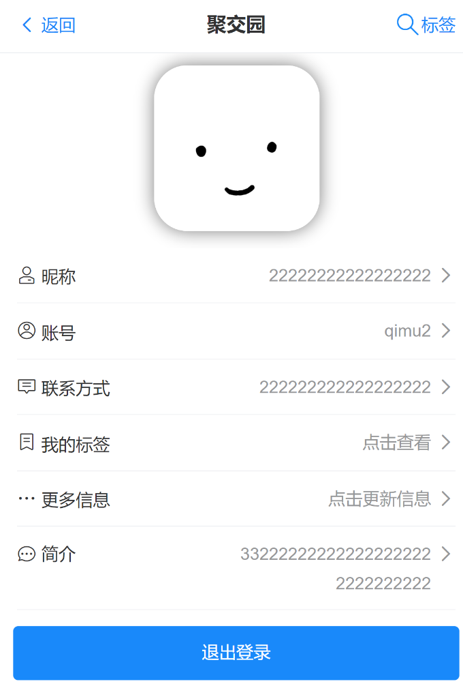

# 聚交园

## 大家找到志同道合的朋友的移动端网站（APP风格） 后端

[TOC]

后端地址：[HLACM/Partners-Discovery-Platform (github.com)](https://github.com/HLACM/Partners-Discovery-Platform)


## 界面展示

### 用户登录/注册






### 好友列表/好友申请



### 在线聊天



### 用户推荐页



### 根据标签搜索用户



### 队伍页



### 个人中心页




## 项目描述

- 一个帮助大家找到志同道合的伙伴的移动端网站，主要有用户登录注册、更新个人信息、按标签搜索用户、组队、好友聊天、大厅聊天、队伍聊天等功能。

## 技术选型

### 前端

1. Vue 3

2. Vant UI 组件库（移动端）

3. Vite 脚手架

4. TypeScript

5. Axios 请求库

### 后端

1. Java SpringBoot 2.7.x 框架
2. MySQL 数据库
3. MyBatis-Plus
4. MyBatis X 自动生成
5. Redis 缓存（Spring Data Redis 等多种实现方式）
6. Redisson 分布式锁
7. Swagger + Knife4j 接口文档
8. Gson：JSON 序列化库

### 前后端交互

1. WebSocket

## 项目亮点

1. 用户登录：使用 Redis 实现分布式 Session，解决集群间登录态同步问题；并使用 Hash 代替 String 来存储用户信息，节约了 5%
   的内存并便于单字段的修改。
2. 对于项目中复杂的集合处理（比如为队伍列表关联已加入队伍的用户），使用 Java 8 Stream API 和 Lambda 表达式来简化编码。
3. 使用 Easy Excel 读取收集来的基础用户信息，并通过自定义线程池 + CompletableFuture 并发编程提高批量导入数据库的性能。实测导入
   100 万行的时间从 20秒缩短至 7秒。（需要自己实际测试对比数据）
4. 使用 Redis 缓存首页高频访问的用户信息列表，将接口响应时长从 800ms缩短至 120ms 。且通过自定义 Redis 序列化器来解决数据乱码、空间浪费的问题。
5. 为解决首次访问系统的用户主页加载过慢的问题，使用 Spring Scheduler 定时任务来实现缓存预热，并通过分布式锁保证多机部署时定时任务不会重复执行。
6. 为解决同一用户重复加入队伍、入队人数超限的问题，使用 Redisson 分布式锁来实现操作互斥，保证了接口幂等性。
7. 使用 Knife4j + Swagger 自动生成后端接口文档，并通过编写 ApiOperation 等注解补充接口注释，避免了人工编写维护文档的麻烦。
10. 使用WebSocket实现聊天功能,实时进行交流

## 快速启动

### 后端

1. 运行 sql 目录下的 create_table.sql 建表
2. 修改 application.yml 中的数据库地址为自己的
3. 安装完 Maven 依赖后，直接运行即可

### 前端

安装依赖：

```bash
npm run install
```

运行：

```bash
npm run dev
```

打包：

```bash
npm run build
```

